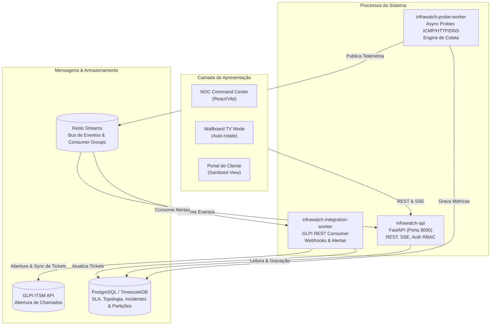

# InfraWatch 🛰️

> **Plataforma Enterprise de Observabilidade de Rede, NOC Telemetry & Gestão Automatizada de Incidentes com GLPI**

[](LICENSE)
[](https://fastapi.tiangolo.com)
[](https://react.dev)
[](https://www.typescriptlang.org)
[](https://www.postgresql.org)
[](https://redis.io)
[](https://glpi-project.org)

---

## 📌 Visão Geral

O **InfraWatch** é uma solução completa de observabilidade e monitoramento de infraestrutura de missão crítica, desenhada para atender provedores de telecomunicações, operadoras e empresas com infraestruturas distribuídas (como RCS Angola e Exija Serviços).

Diferente de ferramentas de monitoramento genéricas ou painéis estáticos, o InfraWatch implementa uma arquitetura orientada a eventos (*Event-Driven Architecture*) com desacoplamento rigoroso entre a coleta de métricas, o processamento de regras/alarmes e a apresentação em tempo real para múltiplos perfis de usuários.

---

## 🏛️ Arquitetura e Decisões de Engenharia

O sistema é construído como um monólito modular orientado a domínio (DDD) subdividido em 3 processos desacoplados que compartilham o mesmo repositório e infraestrutura de mensageria:



### Principais Pilares Arquiteturais
1. **Desacoplamento por Processos (ADR-001):** A API HTTP não executa coletas pesadas de rede; todo o probing assíncrono reside no `infrawatch-probe-worker`.
2. **Eliminação de BackgroundTasks em Favor de Consumers (ADR-003, ADR-020):** `background_tasks.add_task` foi eliminado para evitar vazamentos de sessão assíncrona (`AsyncSession`). Todas as integrações externas e notificações operam via *Consumers* no Redis Streams com DLQ (*Dead-Letter Queue*).
3. **Resiliência Transacional com Outbox Pattern (ADR-009):** Nenhuma sincronização com sistemas externos (GLPI, Webhooks) bloqueia o fluxo operacional da API. Eventos são persistidos atomicamente em banco e processados pelo worker com política de retentativa exponencial.
4. **Isolamento Multitenant Rigoroso com Papel `CLIENT_VIEWER` (ADR-012):** Clientes corporativos visualizam exclusivamente métricas e SLAs de seus próprios equipamentos através de uma visão sanitizada (sem exposição de IPs de gerência interna ou topologias reservadas).
5. **Janelas de Manutenção & Isenção de SLA (ADR-011):** Períodos de manutenção programada silênciam alarmes sonoros e são isentos do cômputo de penalização nos relatórios de SLA contratuais.
6. **Hardening de Segurança (ADR-021 a ADR-025):**
   - *Dual-Key Rate Limiting* (IP + E-mail) para mitigar ataques de força bruta distribuídos.
   - Respostas de login com tempo constante neutro (~10ms) para neutralizar ataques de temporização e enumeração de usuários.
   - Validação de *Trusted Proxies* no reverse proxy / Uvicorn.
   - Endpoint `/metrics` do Prometheus protegido por credenciais dedicadas de observabilidade.

---

## ⚡ Funcionalidades Principais

- 📡 **Micro-Probes Distribuídos:** Probes assíncronos ICMP (Ping), HTTP/HTTPS (Status, Latência, TLS) e DNS com suporte a limiares de degradação dinâmicos (*Degraded State* por jitter e perda intermitente de pacotes).
- 🎫 **Integração Bidirecional Nativa com GLPI:** Abertura automática de chamados para incidentes de severidade `CRITICAL`, rastreamento de IDs de chamados e sincronização periódica de status.
- 📊 **Cálculo de SLA em Tempo Real:** Motor analítico com cálculo de MTBF, MTTR, disponibilidade percentual mensal (ex: 99.9%) e geração de relatórios executivos em PDF.
- 🖥️ **Cockpit NOC & Modo TV:** Interface de alta densidade no padrão *Dark Slate*, gráficos de telemetria sem recarregamento de página via SSE (*Server-Sent Events*) e modo rotação automática para monitores de parede no centro de operações.
- 🏢 **Portal do Cliente Sanitizado:** Visão simplificada e transparente para clientes corporativos (bancos, empresas e operadoras parceiras) consultarem a saúde de seus enlaces contratados.

---

## 📚 Documentação do Projeto

Toda a documentação técnica, contratos de API, especificações e planos de implementação estão organizados no diretório [`docs/`](docs/):

| Documento | Descrição |
| :--- | :--- |
| [ARCHITECTURE.MD](ARCHITECTURE.MD) | Arquitetura de software DDD, topologia de processos, barramento de eventos e fluxos |
| [01-PRD.md](docs/01-PRD.md) | Documento de Requisitos de Produto (Escopo, Personas, SLAs, Métricas) |
| [02-TRD.md](docs/02-TRD.md) | Especificação Técnica (Contratos de API, Integração GLPI, Redis Streams, SSE) |
| [03-APP_FLOW.md](docs/03-APP_FLOW.md) | Fluxos de Aplicação (NOC, Triagem de Incidentes, Manutenção, Portal do Cliente) |
| [04-UI_UX_BRIEF.md](docs/04-UI_UX_BRIEF.md) | Especificação de Design System (Paleta Obsidian, Tipografia, Componentes) |
| [05-BACKEND_SCHEMA.md](docs/05-BACKEND_SCHEMA.md) | DDL Completo do Banco de Dados, Índices, Constraints e Particionamento |
| [06-IMPLEMENTATION_PLAN.md](docs/06-IMPLEMENTATION_PLAN.md) | Plano Detalhado de Implementação em 6 Fases (Tarefas 1.1 a 6.5) |
| [DECISIONS.md](docs/DECISIONS.md) | Registro de Decisões de Arquitetura (ADR-001 a ADR-025) |

---

## 🛠️ Stack Tecnológica

### Backend & Workers
- **Linguagem & Framework:** Python 3.12+, FastAPI
- **ORM & Banco de Dados:** SQLAlchemy 2.0 (AsyncIO), PostgreSQL 16 com partições de séries temporais
- **Mensageria & Cache:** Redis 7.2+ (Streams, Consumer Groups, Distributed Locks)
- **Segurança & Criptografia:** Argon2-cffi, PyJWT, SecretStr

### Frontend
- **Framework & Ferramentas:** React 18, TypeScript 5.5, Vite
- **Gerenciamento de Estado & Consultas:** TanStack Query (React Query) + Zustand
- **Estilização & Componentes:** TailwindCSS / CSS puro calibrado no padrão Obsidian Telemetry
- **Visualização de Dados:** Lucide React, Recharts / ECharts

### Infraestrutura & DevOps
- Docker & Docker Compose para orquestração de microsserviços e workers
- Prometheus & Grafana para telemetria de produção
- GitHub Actions para CI/CD automatizado

---

## 🚀 Como Executar Localmente

### Pré-requisitos
- Docker & Docker Compose
- Python 3.12+ (uv ou poetry recomendado)
- Node.js 20+ e pnpm / npm

### Passo a Passo

1. **Clonar o repositório:**
   ```bash
   git clone https://github.com/NdondaDaniel2020/InfraWatch.git
   cd InfraWatch
   ```

2. **Configurar variáveis de ambiente:**
   ```bash
   cp .env.example .env
   # Preencher credenciais do PostgreSQL, Redis, GLPI e JWT Secrets
   ```

3. **Iniciar a infraestrutura auxiliar (PostgreSQL + Redis):**
   ```bash
   docker-compose up -d postgres redis
   ```

4. **Executar as migrações de banco:**
   ```bash
   alembic upgrade head
   ```

5. **Iniciar os serviços:**
   ```bash
   # Terminal 1: API REST & SSE
   uvicorn src.api.main:app --host 0.0.0.0 --port 8000 --reload

   # Terminal 2: Probe Worker (Coleta ICMP/HTTP/DNS)
   python -m src.workers.probe_worker

   # Terminal 3: Integration Worker (GLPI & Webhooks)
   python -m src.workers.integration_worker
   ```

---

## 📄 Licença

Este projeto está sob a licença [MIT](LICENSE). Consulte o arquivo de licença para mais detalhes.
