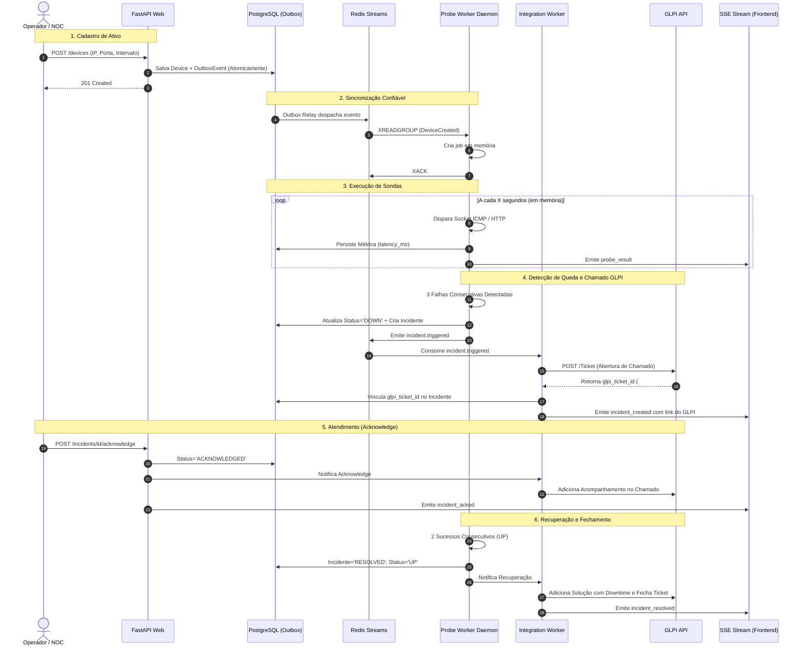

# InfraWatch — Fluxos da Aplicação e Ciclos de Vida (APP FLOW)

> **Documento:** 03-APP_FLOW.md  
> **Status:** Aprovado e Consolidado  
> **Objetivo:** Mapear o ciclo de vida ponta a ponta dos eventos, jornadas dos usuários e processos assíncronos.

---

## 1. Visão Geral dos Fluxos Integrados

---

## 2. Detalhamento das Fases

### Fase 1: Cadastro e Onboarding do Ativo
- Operador envia requisição para a API.
- Entidade `Device` é validada e gravada no PostgreSQL juntamente com o evento `DeviceCreated` na tabela `outbox_events` (mesma transação ACID).
- O Outbox Worker grava a mensagem no Redis Stream `stream:inventory:changes`.
- O `infrawatch-probe-worker` lê a mensagem via `XREADGROUP`, instancia a tarefa assíncrona em memória e confirma com `XACK`.

### Fase 2: Execução de Sondas e Streaming
- O Probe Worker executa pings e requests HTTP em loop local de timers.
- A cada coleta, grava na tabela particionada `metrics` e despacha o evento via SSE para atualizar os micrográficos dos dashboards conectados.

### Fase 3: Detecção de Incidente e Abertura no GLPI
- Ao atingir o limiar de 3 falhas consecutivas, o ativo transiciona para `DOWN`.
- O incidente é criado no banco de dados e notificado ao `infrawatch-integration-worker`.
- O Integration Worker autentica na API REST do GLPI e abre o chamado com título, descrição do ativo e criticidade alta.
- O `glpi_ticket_id` é registrado no incidente e transmitido via SSE para a tela do NOC.
- Simultaneamente, são disparados alertas via WhatsApp/SMS (número virtual), Telegram Bot e Webhook (Slack/Discord).

### Fase 4: Operação de NOC (Acknowledge)
- O operador clica em **Reconhecer** no dashboard.
- A interface sincroniza via SSE para todos os operadores saberem que o caso está em atendimento.
- Uma nota é inserida no ticket do GLPI informando que a equipe assumiu a investigação.

### Fase 5: Normalização e Fechamento
- Quando o serviço volta a responder por 2 sondas consecutivas, o status volta para `UP`.
- O incidente é marcado como `RESOLVED`, registrando o tempo exato de downtime.
- O chamado no GLPI é atualizado com a solução técnica e o tempo de indisponibilidade registrado no SLA mensal do cliente.

---

## 3. Fluxos Operacionais Específicos

### 3.1 Fluxo de Detecção de Degradação (Latência Alta)
1. O Probe Worker mede o RTT e detecta que a latência superou `latency_threshold_warning_ms` (ex: > 250ms por 3 checagens).
2. O dispositivo transiciona para o status `DEGRADED`.
3. Um alerta de severidade `WARNING` é gerado e despachado via SSE.
4. **Não abre chamado crítico no GLPI**, mas notifica os canais configurados para receber alertas de nível `WARNING`.
5. Se a latência normalizar por 2 checagens, o status retorna para `UP`.

### 3.2 Fluxo de Janela de Manutenção Programada e SLA
1. Operador agenda uma janela em `/devices/{id}/maintenance` definindo `start_time`, `end_time` e motivo.
2. Durante a janela:
   - O dispositivo exibe status `MAINTENANCE` (Azul elétrico).
   - O envio de alertas para clientes é suspenso.
   - O motor de cálculo de SLA **isenta e desconta** esse período do cálculo de disponibilidade (não penaliza a meta de 99.5%).

### 3.3 Fluxo de Acesso do Cliente Final (CLIENT_VIEWER)
1. O usuário do cliente (ex: Banco Sol) faz login em `/login`.
2. A API identifica o papel `CLIENT_VIEWER` e filtra automaticamente todas as consultas pelo seu `organization_id`.
3. Na visualização:
   - O cliente visualiza apenas os seus próprios servidores e quiosques.
   - Detalhes confidenciais de rede (IPs locais `10.x.x.x`, portas de banco) são sanitizados/ocultos.
   - O cliente acompanha o percentual de SLA acumulado do mês e a saúde geral de seus serviços corporativos.
