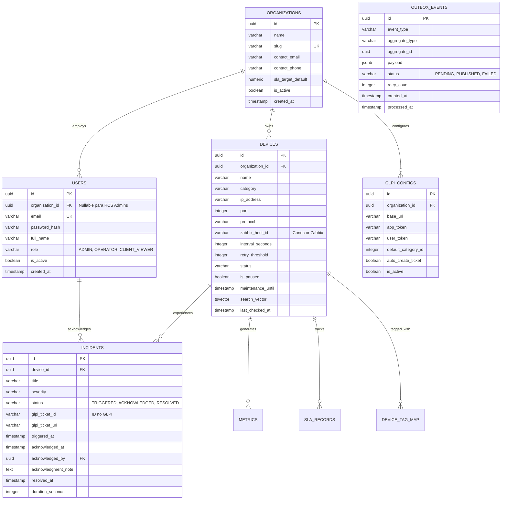

# InfraWatch — Schema do Backend e Persistência (BACKEND_SCHEMA)

> **Documento:** 05-BACKEND_SCHEMA.md  
> **Status:** Aprovado e Consolidado  
> **Banco Relacional:** PostgreSQL 16+ (com Particionamento Nativo)  
> **Barramento / Cache:** Redis 7+ com Streams e Fallback In-Memory

---

## 1. Diagrama Entidade-Relacionamento Completo



---

## 2. DDL PostgreSQL Completo e Otimizado

### 2.1 Extensões
```sql
CREATE EXTENSION IF NOT EXISTS "uuid-ossp";
CREATE EXTENSION IF NOT EXISTS "pgcrypto";
```

### 2.2 Tabela `organizations` (Multi-Tenancy por Cliente)
```sql
CREATE TABLE organizations (
    id UUID PRIMARY KEY DEFAULT gen_random_uuid(),
    name VARCHAR(150) NOT NULL,
    slug VARCHAR(100) NOT NULL UNIQUE,
    contact_email VARCHAR(255),
    contact_phone VARCHAR(50),
    sla_target_default NUMERIC(5,2) NOT NULL DEFAULT 99.50,
    is_active BOOLEAN NOT NULL DEFAULT TRUE,
    created_at TIMESTAMPTZ NOT NULL DEFAULT NOW(),
    updated_at TIMESTAMPTZ NOT NULL DEFAULT NOW()
);

CREATE INDEX idx_organizations_slug ON organizations(slug);
```

### 2.3 Tabela `users` (Identity & RBAC com Escopo de Tenant)
```sql
CREATE TABLE users (
    id UUID PRIMARY KEY DEFAULT gen_random_uuid(),
    organization_id UUID REFERENCES organizations(id) ON DELETE CASCADE,
    email VARCHAR(255) NOT NULL UNIQUE,
    password_hash VARCHAR(255) NOT NULL,
    full_name VARCHAR(150) NOT NULL,
    role VARCHAR(20) NOT NULL DEFAULT 'CLIENT_VIEWER' 
        CHECK (role IN ('ADMIN', 'OPERATOR', 'CLIENT_VIEWER')),
    is_active BOOLEAN NOT NULL DEFAULT TRUE,
    created_at TIMESTAMPTZ NOT NULL DEFAULT NOW(),
    updated_at TIMESTAMPTZ NOT NULL DEFAULT NOW()
);

CREATE INDEX idx_users_email ON users(email);
CREATE INDEX idx_users_org ON users(organization_id);
```

### 2.4 Tabela `refresh_tokens` (Baseado no Projeto Auth com Rotação)
```sql
CREATE TABLE refresh_tokens (
    id UUID PRIMARY KEY DEFAULT gen_random_uuid(),
    user_id UUID NOT NULL REFERENCES users(id) ON DELETE CASCADE,
    token_hash VARCHAR(255) NOT NULL UNIQUE,
    expires_at TIMESTAMPTZ NOT NULL,
    is_revoked BOOLEAN NOT NULL DEFAULT FALSE,
    created_at TIMESTAMPTZ NOT NULL DEFAULT NOW()
);

CREATE INDEX idx_refresh_tokens_lookup ON refresh_tokens(token_hash, is_revoked, expires_at);
```

### 2.5 Tabela `devices` (Inventário, FTS e Conector Zabbix)
```sql
CREATE TABLE devices (
    id UUID PRIMARY KEY DEFAULT gen_random_uuid(),
    organization_id UUID NOT NULL REFERENCES organizations(id) ON DELETE CASCADE,
    name VARCHAR(150) NOT NULL,
    description TEXT,
    category VARCHAR(50) NOT NULL DEFAULT 'SERVER' 
        CHECK (category IN ('SERVER', 'ROUTER', 'SWITCH', 'APPLICATION', 'DATABASE', 'ENDPOINT', 'KIOSK')),
    ip_address VARCHAR(255) NOT NULL,
    port INTEGER DEFAULT NULL,
    protocol VARCHAR(20) NOT NULL DEFAULT 'ICMP' 
        CHECK (protocol IN ('ICMP', 'HTTP', 'HTTPS', 'TCP', 'SNMP', 'WEBHOOK')),
    http_path VARCHAR(255) DEFAULT '/',
    expected_status_code INTEGER DEFAULT 200,
    interval_seconds INTEGER NOT NULL DEFAULT 30 CHECK (interval_seconds >= 5),
    timeout_seconds INTEGER NOT NULL DEFAULT 5 CHECK (timeout_seconds >= 1),
    -- Limiares de Alerta (Degradação vs Queda)
    latency_threshold_warning_ms INTEGER DEFAULT 250, -- Alerta DEGRADED se ultrapassar
    
    -- Conector Opcional Zabbix
    zabbix_host_id VARCHAR(100) DEFAULT NULL,
    
    -- Estado Operacional Dinâmico
    status VARCHAR(20) NOT NULL DEFAULT 'UP' 
        CHECK (status IN ('UP', 'DEGRADED', 'DOWN', 'MAINTENANCE', 'PAUSED')),
    is_paused BOOLEAN NOT NULL DEFAULT FALSE,
    maintenance_until TIMESTAMPTZ DEFAULT NULL,
    current_consecutive_failures INTEGER NOT NULL DEFAULT 0,
    last_checked_at TIMESTAMPTZ DEFAULT NULL,
    last_status_change_at TIMESTAMPTZ DEFAULT NOW(),
    
    -- Busca Textual Full-Text com Pesos
    search_vector TSVECTOR GENERATED ALWAYS AS (
        setweight(to_tsvector('portuguese', coalesce(name, '')), 'A') ||
        setweight(to_tsvector('portuguese', coalesce(ip_address, '')), 'A') ||
        setweight(to_tsvector('portuguese', coalesce(category, '')), 'B') ||
        setweight(to_tsvector('portuguese', coalesce(description, '')), 'C')
    ) STORED,

    created_at TIMESTAMPTZ NOT NULL DEFAULT NOW(),
    updated_at TIMESTAMPTZ NOT NULL DEFAULT NOW()
);

CREATE INDEX idx_devices_org ON devices(organization_id);
CREATE INDEX idx_devices_status ON devices(status);
CREATE INDEX idx_devices_search_vector ON devices USING GIN(search_vector);
CREATE INDEX idx_devices_worker_active ON devices(is_paused) WHERE is_paused = FALSE;
```

### 2.6 Tabela `incidents` (Incidentes com Integração GLPI)
```sql
CREATE TABLE incidents (
    id UUID PRIMARY KEY DEFAULT gen_random_uuid(),
    device_id UUID NOT NULL REFERENCES devices(id) ON DELETE CASCADE,
    title VARCHAR(255) NOT NULL,
    description TEXT,
    severity VARCHAR(20) NOT NULL DEFAULT 'CRITICAL' CHECK (severity IN ('INFO', 'WARNING', 'CRITICAL')),
    status VARCHAR(20) NOT NULL DEFAULT 'TRIGGERED' CHECK (status IN ('TRIGGERED', 'ACKNOWLEDGED', 'RESOLVED')),
    
    -- Vínculo com Chamado GLPI
    glpi_ticket_id VARCHAR(50) DEFAULT NULL,
    glpi_ticket_url VARCHAR(255) DEFAULT NULL,
    
    triggered_at TIMESTAMPTZ NOT NULL DEFAULT NOW(),
    acknowledged_at TIMESTAMPTZ,
    acknowledged_by UUID REFERENCES users(id) ON DELETE SET NULL,
    acknowledgment_note TEXT,
    
    resolved_at TIMESTAMPTZ,
    duration_seconds INTEGER DEFAULT NULL,
    created_at TIMESTAMPTZ NOT NULL DEFAULT NOW()
);

CREATE INDEX idx_incidents_active ON incidents(status, triggered_at DESC) 
    WHERE status IN ('TRIGGERED', 'ACKNOWLEDGED');
CREATE INDEX idx_incidents_device ON incidents(device_id, triggered_at DESC);
CREATE INDEX idx_incidents_glpi ON incidents(glpi_ticket_id) WHERE glpi_ticket_id IS NOT NULL;
```

### 2.7 Tabela `glpi_configs` (Parâmetros da API do GLPI)
```sql
CREATE TABLE glpi_configs (
    id UUID PRIMARY KEY DEFAULT gen_random_uuid(),
    organization_id UUID REFERENCES organizations(id) ON DELETE CASCADE,
    base_url VARCHAR(255) NOT NULL,
    app_token VARCHAR(255) NOT NULL,
    user_token VARCHAR(255) NOT NULL,
    default_category_id INTEGER DEFAULT NULL,
    auto_create_ticket BOOLEAN NOT NULL DEFAULT TRUE,
    is_active BOOLEAN NOT NULL DEFAULT TRUE,
    created_at TIMESTAMPTZ NOT NULL DEFAULT NOW(),
    updated_at TIMESTAMPTZ NOT NULL DEFAULT NOW()
);
```

### 2.8 Tabela `maintenance_windows` (Janelas de Manutenção Programada)
```sql
CREATE TABLE maintenance_windows (
    id UUID PRIMARY KEY DEFAULT gen_random_uuid(),
    device_id UUID NOT NULL REFERENCES devices(id) ON DELETE CASCADE,
    title VARCHAR(150) NOT NULL,
    reason TEXT,
    start_time TIMESTAMPTZ NOT NULL,
    end_time TIMESTAMPTZ NOT NULL,
    is_active BOOLEAN NOT NULL DEFAULT TRUE,
    created_by_user_id UUID REFERENCES users(id) ON DELETE SET NULL,
    created_at TIMESTAMPTZ NOT NULL DEFAULT NOW(),
    CONSTRAINT chk_maintenance_time CHECK (end_time > start_time)
);

CREATE INDEX idx_maintenance_active ON maintenance_windows(device_id, start_time, end_time) 
    WHERE is_active = TRUE;
```

### 2.9 Tabela `audit_logs` (Trilha de Auditoria Imutável - Compliance)
```sql
CREATE TABLE audit_logs (
    id UUID PRIMARY KEY DEFAULT gen_random_uuid(),
    user_id UUID REFERENCES users(id) ON DELETE SET NULL,
    organization_id UUID REFERENCES organizations(id) ON DELETE CASCADE,
    action VARCHAR(50) NOT NULL, -- 'DEVICE_CREATED', 'DEVICE_PAUSED', 'MAINTENANCE_STARTED', 'INCIDENT_ACKED'
    resource_type VARCHAR(50) NOT NULL, -- 'DEVICE', 'INCIDENT', 'ALERT_RULE', 'USER'
    resource_id VARCHAR(100) NOT NULL,
    details JSONB NOT NULL DEFAULT '{}'::jsonb,
    ip_address VARCHAR(45),
    created_at TIMESTAMPTZ NOT NULL DEFAULT NOW()
);

CREATE INDEX idx_audit_logs_org_time ON audit_logs(organization_id, created_at DESC);
CREATE INDEX idx_audit_logs_user ON audit_logs(user_id, created_at DESC);
```

### 2.10 Tabela `notification_channels` (Canais e Escalas de Plantão)
```sql
CREATE TABLE notification_channels (
    id UUID PRIMARY KEY DEFAULT gen_random_uuid(),
    organization_id UUID REFERENCES organizations(id) ON DELETE CASCADE,
    name VARCHAR(100) NOT NULL,
    channel_type VARCHAR(20) NOT NULL 
        CHECK (channel_type IN ('EMAIL', 'TELEGRAM', 'WHATSAPP', 'WEBHOOK_SLACK', 'WEBHOOK_DISCORD', 'WEBHOOK_TEAMS')),
    config JSONB NOT NULL, -- webhook_url, chat_id, phone_number, smtp_to
    
    -- Escalas de Plantão e Filtros
    active_hours_start TIME DEFAULT '08:00:00',
    active_hours_end TIME DEFAULT '18:00:00',
    days_of_week VARCHAR(20) DEFAULT '1,2,3,4,5', -- 1=Segunda a 7=Domingo
    allow_critical_outside_hours BOOLEAN NOT NULL DEFAULT TRUE, -- Quedas críticas ignoram horário
    subscribed_severities VARCHAR(50) NOT NULL DEFAULT 'CRITICAL,WARNING',
    
    is_enabled BOOLEAN NOT NULL DEFAULT TRUE,
    created_at TIMESTAMPTZ NOT NULL DEFAULT NOW(),
    updated_at TIMESTAMPTZ NOT NULL DEFAULT NOW()
);

CREATE INDEX idx_notification_channels_org ON notification_channels(organization_id);
```

### 2.11 Tabela de Séries Temporais: `metrics` (Particionada por Data - Retenção de 30 Dias)
```sql
CREATE TABLE metrics (
    id BIGSERIAL,
    device_id UUID NOT NULL REFERENCES devices(id) ON DELETE CASCADE,
    recorded_at TIMESTAMPTZ NOT NULL DEFAULT NOW(),
    latency_ms DOUBLE PRECISION,
    status_code INTEGER,
    is_success BOOLEAN NOT NULL,
    error_message TEXT,
    PRIMARY KEY (id, recorded_at)
) PARTITION BY RANGE (recorded_at);

CREATE TABLE metrics_2026_09 PARTITION OF metrics
    FOR VALUES FROM ('2026-09-01 00:00:00+00') TO ('2026-10-01 00:00:00+00');
CREATE TABLE metrics_2026_10 PARTITION OF metrics
    FOR VALUES FROM ('2026-10-01 00:00:00+00') TO ('2026-11-01 00:00:00+00');

CREATE INDEX idx_metrics_device_time ON metrics(device_id, recorded_at DESC);
```

### 2.12 Tabela `outbox_events` (Transactional Outbox)
```sql
CREATE TABLE outbox_events (
    id UUID PRIMARY KEY DEFAULT gen_random_uuid(),
    event_type VARCHAR(100) NOT NULL,
    aggregate_type VARCHAR(100) NOT NULL,
    aggregate_id UUID NOT NULL,
    payload JSONB NOT NULL,
    status VARCHAR(20) NOT NULL DEFAULT 'PENDING' CHECK (status IN ('PENDING', 'PUBLISHED', 'FAILED')),
    retry_count INTEGER NOT NULL DEFAULT 0,
    error_message TEXT,
    created_at TIMESTAMPTZ NOT NULL DEFAULT NOW(),
    processed_at TIMESTAMPTZ DEFAULT NULL
);

CREATE INDEX idx_outbox_pending ON outbox_events(created_at ASC) 
    WHERE status = 'PENDING';
```

---

## 3. Redis Streams e Chaves Estruturadas

| Chave / Stream | Tipo | Finalidade |
| :--- | :--- | :--- |
| `stream:inventory:changes` | **Redis Stream** | Log persistido de inclusão/alteração/pausa de ativos para o Probe Worker consumir com `XREADGROUP` e confirmação `XACK`. |
| `channel:events:sse` | **PubSub Channel** | Distribuição de eventos SSE em tempo real para os navegadores. |
| `blacklist:token:{jti}` | **String (TTL = 15m)** | Revogação de Access Tokens no logout. |
| `cache:device:{id}:realtime` | **Hash (TTL = 120s)** | Leitura ultrarrápida do último status e latência. |
