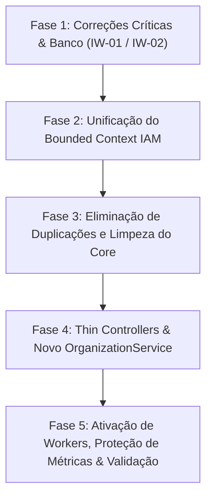

# 🚀 Plano de Implementação: Opção B (Monolito Modular com Bounded Context IAM Unificado)

> **Projeto:** `InfraWatch` (`/spot/NdDaniel/Code/Estudo/InfraWatch`)  
> **Objetivo:** Consolidar a arquitetura em um **Monolito Modular verdadeiro (Vertical Slices)**, unificando os domínios de Acesso e Identidade em `src/contexts/iam/`, limpando o *Shared Kernel* (`src/core/`) e preparando o repositório para receber os módulos futuros de **Monitoramento** e **Alertas**.  
> **Estratégia:** Execução cirúrgica em 5 fases sequenciais, preservando os 170 testes existentes e eliminando débitos técnicos e duplicidades.

---

## 🏛️ Visão da Arquitetura Alvo

```text
backend/src/
├── core/                                # Shared Kernel (Cross-cutting puro)
│   ├── config.py                        # Pydantic Settings (com validador de secret key)
│   ├── database/                        # Sessão assíncrona e BaseModel com UUIDv7
│   ├── messaging/                       # ResilientBus (Redis Streams + In-Memory), Outbox base
│   ├── observability/                   # Logging contextual, Metrics Prometheus, Tracing
│   └── security/                        # Hashes (Argon2), Audit Chain (SHA-256), Timing Attack
│
├── contexts/
│   ├── iam/                             # 🛡️ Bounded Context IAM (Identity & Access Management)
│   │   ├── api/                         # Camada Web do IAM
│   │   │   ├── dependencies/            # CurrentUser, RBAC, Multi-tenant Scope
│   │   │   ├── routes/                  # auth, users, organizations, mfa, sse, audit
│   │   │   └── router.py                # Agregador prefixado em /api/v1
│   │   ├── domain/                      # Modelos SQLAlchemy, Enums e Eventos de Domínio
│   │   ├── repositories/                # UserRepository, OrganizationRepository, TokenRepo...
│   │   ├── schemas/                     # Schemas Pydantic (Auth, User, Org, MFA, Session)
│   │   ├── security/                    # ÚNICA fonte de verdade de Tokens JWT + Opaque
│   │   ├── services/                    # AuthService, UserService, OrganizationService...
│   │   └── templates/                   # E-mails transacionais (Jinja2)
│   │
│   ├── monitoring/ (FUTURO)             # 📡 Módulo futuro de Probes, Switches e Pings
│   └── alerting/   (FUTURO)             # 🚨 Módulo futuro de Regras de SLA e Incidentes NOC
│
├── workers/                             # Daemons de segundo plano (Outbox Relay e Token Cleanup)
└── main.py                              # FastAPI Application agregadora e Lifespan
```

---

## 📅 Fases do Plano de Execução



---

### 🔴 Fase 1: Correções Críticas & Banco de Dados (Pré-requisitos de Deploy)

**Objetivo:** Eliminar bloqueadores imediatos de deploy e inconsistências do banco de dados antes da reestruturação.

- [ ] **1.1. Criar Migração 006 no Alembic:**
  - **Arquivo:** [`backend/alembic/versions/006_create_mfa_and_token_tables.py`](file:///spot/NdDaniel/Code/Estudo/InfraWatch/backend/alembic/versions)
  - **Ação:** Criar as tabelas `mfa_methods`, `email_verification_tokens`, `password_reset_tokens` e adicionar colunas `is_verified`, `mfa_enabled`, `mfa_type` em `users` e `device_name` em `refresh_tokens`.
- [ ] **1.2. Corrigir Healthcheck do Container:**
  - **Arquivo:** [`backend/Dockerfile.api`](file:///spot/NdDaniel/Code/Estudo/InfraWatch/backend/Dockerfile.api#L55)
  - **Ação:** Alterar rota de `/api/v1/monitoring/health` para `/api/health`.
- [ ] **1.3. Parametrizar TTL de Recuperação de Senha:**
  - **Arquivos:** [`src/core/config.py`](file:///spot/NdDaniel/Code/Estudo/InfraWatch/backend/src/core/config.py) e [`src/contexts/identity/services/auth_service.py`](file:///spot/NdDaniel/Code/Estudo/InfraWatch/backend/src/contexts/identity/services/auth_service.py#L200)
  - **Ação:** Definir `PASSWORD_RESET_TOKEN_EXPIRE_MINUTES = 15` e consumir via `settings`.

---

### 🛡️ Fase 2: Unificação do Bounded Context IAM (`src/contexts/iam/`)

**Objetivo:** Resolver a fragmentação entre `identity` e `organization`, unificando todo o ciclo de vida de acesso, usuários e tenants em um módulo vertical coeso.

- [ ] **2.1. Criar a pasta do contexto IAM:**
  - Renomear/Migrar `src/contexts/identity` para `src/contexts/iam`.
- [ ] **2.2. Incorporar `organization` no IAM:**
  - Mover [`src/contexts/organization/domain/models.py`](file:///spot/NdDaniel/Code/Estudo/InfraWatch/backend/src/contexts/organization/domain/models.py) (`OrganizationModel`) para `src/contexts/iam/domain/models.py`.
  - Mover [`src/contexts/organization/repositories/organization_repository.py`](file:///spot/NdDaniel/Code/Estudo/InfraWatch/backend/src/contexts/organization/repositories/organization_repository.py) para `src/contexts/iam/repositories/organization_repository.py`.
  - Mover [`src/contexts/organization/schemas/organization.py`](file:///spot/NdDaniel/Code/Estudo/InfraWatch/backend/src/contexts/organization/schemas/organization.py) para `src/contexts/iam/schemas/organization.py`.
- [ ] **2.3. Deletar arquivos ocos e atalhos fantoche:**
  - Excluir o arquivo atalho: `src/contexts/identity/repositories/organization_repository.py`.
  - Excluir o diretório obsoleto: `src/contexts/organization/`.

---

### 🧹 Fase 3: Eliminação de Duplicações e Limpeza do Core

**Objetivo:** Acabar com fontes concorrentes de tokens e remover abstrações mortas de "vitrine".

- [ ] **3.1. Unificar Módulo de Tokens JWT:**
  - **Remover:** [`src/core/security/tokens.py`](file:///spot/NdDaniel/Code/Estudo/InfraWatch/backend/src/core/security/tokens.py) (versão legada e simplificada).
  - **Consolidar:** [`src/contexts/iam/security/tokens.py`](file:///spot/NdDaniel/Code/Estudo/InfraWatch/backend/src/contexts/identity/security/tokens.py) como o **único emissor e validador** de tokens JWT e opacos.
  - Atualizar dependências em [`src/api/dependencies/auth.py`](file:///spot/NdDaniel/Code/Estudo/InfraWatch/backend/src/api/dependencies/auth.py) para importar da fonte unificada.
- [ ] **3.2. Sanear Abstrações Fantasma no Core:**
  - Avaliar e remover [`src/core/domain/aggregate.py`](file:///spot/NdDaniel/Code/Estudo/InfraWatch/backend/src/core/domain/aggregate.py) e [`src/core/database/unit_of_work.py`](file:///spot/NdDaniel/Code/Estudo/InfraWatch/backend/src/core/database/unit_of_work.py) se não forem utilizados pelas entidades reais, simplificando o repositório.
- [ ] **3.3. Adicionar Validador de Chave Secreta em Produção:**
  - Adicionar `@field_validator("SECRET_KEY")` em [`src/core/config.py`](file:///spot/NdDaniel/Code/Estudo/InfraWatch/backend/src/core/config.py) rejeitando segredos padrão quando `ENVIRONMENT == "production"`.

---

### ⚡ Fase 4: Thin Controllers & Criação do `OrganizationService`

**Objetivo:** Restaurar a separação de responsabilidades (SoC) no mesmo padrão de excelência do projeto `Auth`.

- [ ] **4.1. Criar `OrganizationService`:**
  - **Arquivo:** `src/contexts/iam/services/organization_service.py`
  - **Responsabilidades:**
    - Validação de regras de negócio de criação de tenants e unicidade de slugs.
    - Persistência através de `OrganizationRepository`.
    - Disparo de eventos via Outbox (`OrganizationCreatedEvent`).
- [ ] **4.2. Refatorar `organizations.py` (Eliminar SQL Cru na Rota):**
  - **Arquivo:** [`src/api/routes/organizations.py`](file:///spot/NdDaniel/Code/Estudo/InfraWatch/backend/src/api/routes/organizations.py)
  - Substituir queries diretas e transações manuais por chamadas a `organization_service.create_organization(...)` e `organization_service.list_organizations(...)`.
- [ ] **4.3. Unificar Dependências de Autenticação (Eliminar `get_sse_current_user`):**
  - Fazer [`get_current_user`](file:///spot/NdDaniel/Code/Estudo/InfraWatch/backend/src/api/dependencies/auth.py#L46) aceitar token tanto do header `Authorization: Bearer` quanto do query parameter `?token=`.
  - Atualizar [`src/api/routes/sse.py`](file:///spot/NdDaniel/Code/Estudo/InfraWatch/backend/src/api/routes/sse.py) para usar `CurrentUserDep`.
  - Excluir `get_sse_current_user`.

---

### 🛡️ Fase 5: Ativação de Workers, Proteção de Métricas & Validação Final

**Objetivo:** Deixar o runtime 100% operacional, seguro e com toda a suíte de testes aprovada.

- [ ] **5.1. Proteger Rota `/metrics` com HTTP Basic Auth:**
  - **Arquivo:** [`src/api/main.py`](file:///spot/NdDaniel/Code/Estudo/InfraWatch/backend/src/api/main.py#L54-L58)
  - Utilizar a dependência [`metrics_auth.py`](file:///spot/NdDaniel/Code/Estudo/InfraWatch/backend/src/api/dependencies/metrics_auth.py) para cumprir a **ADR-025**.
- [ ] **5.2. Ativar Daemons no Lifespan da API:**
  - **Arquivo:** [`src/core/lifespan.py`](file:///spot/NdDaniel/Code/Estudo/InfraWatch/backend/src/core/lifespan.py)
  - Inicializar background tasks para `OutboxRelayWorker` e `TokenCleanupWorker`.
- [ ] **5.3. Atualizar Imports na Suíte de Testes:**
  - Ajustar referências de `src.contexts.identity` e `src.contexts.organization` para `src.contexts.iam`.
- [ ] **5.4. Executar Bateria Completa de Testes:**
  - Rodar `pytest` e garantir 100% de aprovação (mínimo de 170 testes passando).
  - Executar teste de subida do Alembic contra banco de dados real.

---

## 📈 Critérios de Sucesso (Definition of Done)

1. ✅ `alembic upgrade head` roda de forma limpa em banco Postgres do zero.
2. ✅ Dockerfile constrói imagem e passa no healthcheck `/api/health`.
3. ✅ Zero arquivos de atalho/re-exportação fantoche no código.
4. ✅ Toda a lógica de tokens concentrada em um único arquivo canônico.
5. ✅ Rotas HTTP 100% limpas de SQL direto (`select(...)`) e `db.commit()` manuais.
6. ✅ Todos os 170 testes de unidade e integração passando com sucesso.
7. ✅ Estrutura de diretórios preparada para receber `contexts/monitoring/` futuramente sem atrito.
